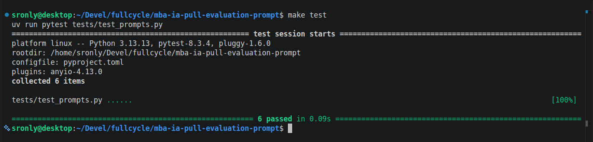
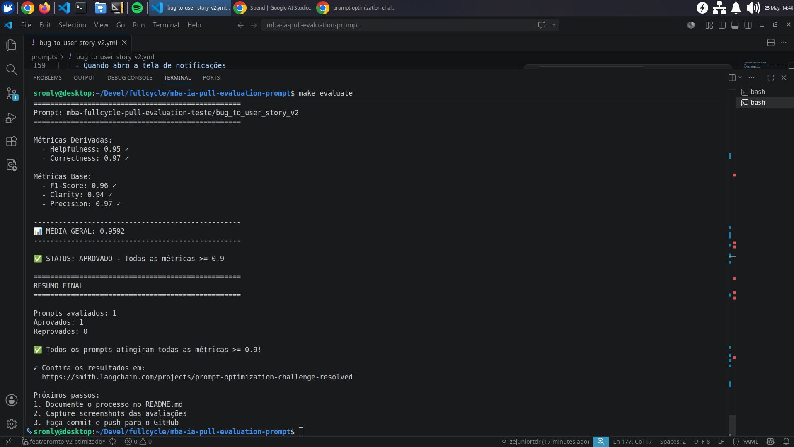
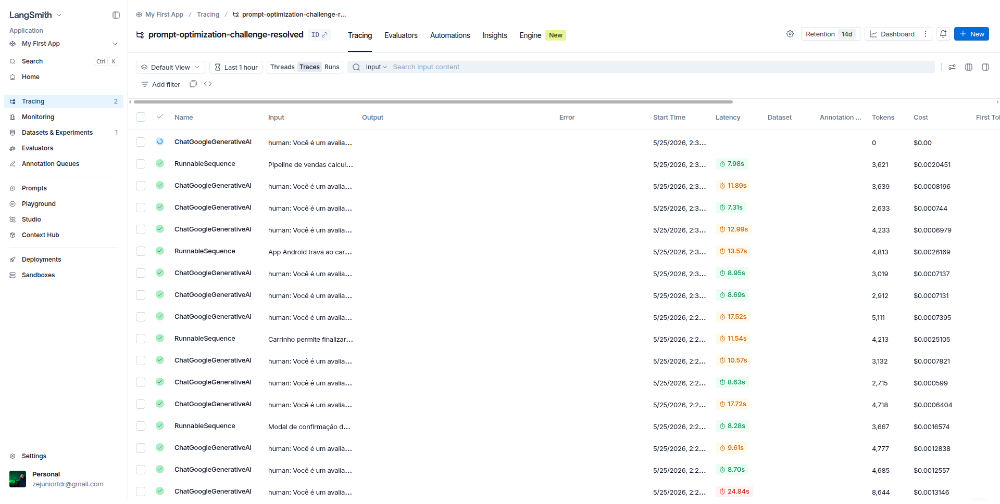
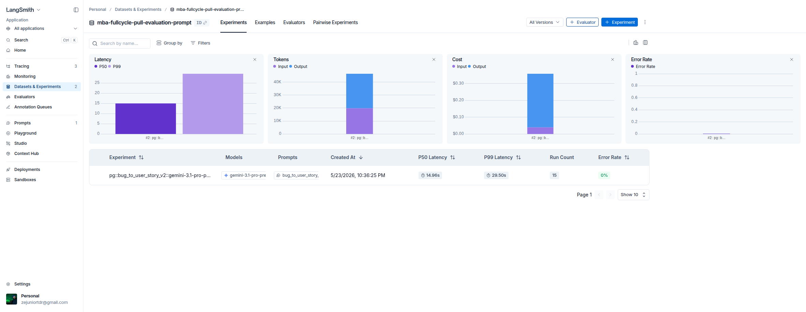
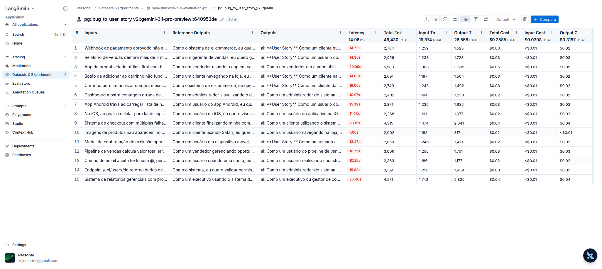

# Pull, Otimização e Avaliação de Prompts com LangChain e LangSmith

## Objetivo

Você deve entregar um software capaz de:

1. **Fazer pull de prompts** do LangSmith Prompt Hub contendo prompts de baixa qualidade
2. **Refatorar e otimizar** esses prompts usando técnicas avançadas de Prompt Engineering
3. **Fazer push dos prompts otimizados** de volta ao LangSmith
4. **Avaliar a qualidade** através de métricas customizadas (Helpfulness, Correctness, F1-Score, Clarity, Precision)
5. **Atingir pontuação mínima** de 0.9 (90%) em todas as métricas de avaliação

---

## Exemplo no CLI

**Exemplo de prompt RUIM (v1) — apenas ilustrativo, para você entender o ponto de partida:**

```
==================================================
Prompt: {seu_username}/bug_to_user_story_v1
==================================================

Métricas Derivadas:
  - Helpfulness: 0.45 ✗
  - Correctness: 0.52 ✗

Métricas Base:
  - F1-Score: 0.48 ✗
  - Clarity: 0.50 ✗
  - Precision: 0.46 ✗

❌ STATUS: REPROVADO
⚠️  Métricas abaixo de 0.9: helpfulness, correctness, f1_score, clarity, precision
```

**Exemplo de prompt OTIMIZADO (v2) — seu objetivo é chegar aqui:**

```bash
# Após refatorar os prompts e fazer push
python src/push_prompts.py

# Executar avaliação
python src/evaluate.py

Executando avaliação dos prompts...
==================================================
Prompt: {seu_username}/bug_to_user_story_v2
==================================================

Métricas Derivadas:
  - Helpfulness: 0.94 ✓
  - Correctness: 0.96 ✓

Métricas Base:
  - F1-Score: 0.93 ✓
  - Clarity: 0.95 ✓
  - Precision: 0.92 ✓

✅ STATUS: APROVADO - Todas as métricas >= 0.9
```
---

## Tecnologias obrigatórias

- **Linguagem:** Python 3.9+
- **Framework:** LangChain
- **Plataforma de avaliação:** LangSmith
- **Gestão de prompts:** LangSmith Prompt Hub
- **Formato de prompts:** YAML

---

## Pacotes recomendados

```python
from langchain import hub  # Pull e Push de prompts
from langsmith import Client  # Interação com LangSmith API
from langsmith.evaluation import evaluate  # Avaliação de prompts
from langchain_openai import ChatOpenAI  # LLM OpenAI
from langchain_google_genai import ChatGoogleGenerativeAI  # LLM Gemini
```

---

## OpenAI

- Crie uma **API Key** da OpenAI: https://platform.openai.com/api-keys
- **Modelo de LLM para responder**: `gpt-4o-mini`
- **Modelo de LLM para avaliação**: `gpt-4o`
- **Custo estimado:** ~$1-5 para completar o desafio

## Gemini (modelo free)

- Crie uma **API Key** da Google: https://aistudio.google.com/app/apikey
- **Modelo de LLM para responder**: `gemini-2.5-flash`
- **Modelo de LLM para avaliação**: `gemini-2.5-flash`
- **Limite:** 15 req/min, 1500 req/dia

---

## Requisitos

### 1. Pull do Prompt inicial do LangSmith

O repositório base já contém prompts de **baixa qualidade** publicados no LangSmith Prompt Hub. Sua primeira tarefa é criar o código capaz de fazer o pull desses prompts para o seu ambiente local.

**Tarefas:**

1. Configurar suas credenciais do LangSmith no arquivo `.env` (conforme o arquivo `.env.example`)
2. Implementar o script `src/pull_prompts.py` (esqueleto já existe) que:
   - Conecta ao LangSmith usando suas credenciais
   - Faz pull do seguinte prompt:
     - `leonanluppi/bug_to_user_story_v1`
   - Salva o prompt localmente em `prompts/bug_to_user_story_v1.yml`

---

### 2. Otimização do Prompt

Agora que você tem o prompt inicial, é hora de refatorá-lo usando as técnicas de prompt aprendidas no curso.

**Tarefas:**

1. Analisar o prompt em `prompts/bug_to_user_story_v1.yml`
2. Criar um novo arquivo `prompts/bug_to_user_story_v2.yml` com suas versões otimizadas
3. Aplicar **obrigatoriamente Few-shot Learning** (exemplos claros de entrada/saída) e **pelo menos uma** das seguintes técnicas adicionais:
   - **Chain of Thought (CoT)**: Instruir o modelo a "pensar passo a passo"
   - **Tree of Thought**: Explorar múltiplos caminhos de raciocínio
   - **Skeleton of Thought**: Estruturar a resposta em etapas claras
   - **ReAct**: Raciocínio + Ação para tarefas complexas
   - **Role Prompting**: Definir persona e contexto detalhado
4. Documentar no `README.md` quais técnicas você escolheu e por quê

**Requisitos do prompt otimizado:**

- Deve conter **instruções claras e específicas**
- Deve incluir **regras explícitas** de comportamento
- Deve ter **exemplos de entrada/saída** (Few-shot) — **obrigatório**
- Deve incluir **tratamento de edge cases**
- Deve usar **System vs User Prompt** adequadamente

---

### 3. Push e Avaliação

Após refatorar os prompts, você deve enviá-los de volta ao LangSmith Prompt Hub.

**Tarefas:**

1. Implementar o script `src/push_prompts.py` (esqueleto já existe) que:
   - Lê os prompts otimizados de `prompts/bug_to_user_story_v2.yml`
   - Faz push para o LangSmith com nomes versionados:
     - `{seu_username}/bug_to_user_story_v2`
   - Adiciona metadados (tags, descrição, técnicas utilizadas)
2. Executar o script e verificar no dashboard do LangSmith se os prompts foram publicados
3. Deixá-lo público

---

### 4. Iteração

- Espera-se 3-5 iterações.
- Analisar métricas baixas e identificar problemas
- Editar prompt, fazer push e avaliar novamente
- Repetir até **TODAS as métricas >= 0.9**

### Critério de Aprovação:

```
- Helpfulness >= 0.9
- Correctness >= 0.9
- F1-Score >= 0.9
- Clarity >= 0.9
- Precision >= 0.9

MÉDIA das 5 métricas >= 0.9
```

**IMPORTANTE:** TODAS as 5 métricas devem estar >= 0.9, não apenas a média!

### 5. Testes de Validação

**O que você deve fazer:** Edite o arquivo `tests/test_prompts.py` e implemente, no mínimo, os 6 testes abaixo usando `pytest`:

- `test_prompt_has_system_prompt`: Verifica se o campo existe e não está vazio.
- `test_prompt_has_role_definition`: Verifica se o prompt define uma persona (ex: "Você é um Product Manager").
- `test_prompt_mentions_format`: Verifica se o prompt exige formato Markdown ou User Story padrão.
- `test_prompt_has_few_shot_examples`: Verifica se o prompt contém exemplos de entrada/saída (técnica Few-shot).
- `test_prompt_no_todos`: Garante que você não esqueceu nenhum `[TODO]` no texto.
- `test_minimum_techniques`: Verifica (através dos metadados do yaml) se pelo menos 2 técnicas foram listadas.

**Como validar:**

```bash
pytest tests/test_prompts.py
```

---

## Estrutura obrigatória do projeto

Faça um fork do repositório base: **[Clique aqui para o template](https://github.com/devfullcycle/mba-ia-pull-evaluation-prompt)**

```
mba-ia-pull-evaluation-prompt/
├── .env.example              # Template das variáveis de ambiente
├── requirements.txt          # Dependências Python
├── README.md                 # Sua documentação do processo
│
├── prompts/
│   ├── bug_to_user_story_v1.yml  # Prompt inicial (já incluso)
│   └── bug_to_user_story_v2.yml  # Seu prompt otimizado (criar)
│
├── datasets/
│   └── bug_to_user_story.jsonl   # 15 exemplos de bugs (já incluso)
│
├── src/
│   ├── pull_prompts.py       # Pull do LangSmith (implementar)
│   ├── push_prompts.py       # Push ao LangSmith (implementar)
│   ├── evaluate.py           # Avaliação automática (pronto)
│   ├── metrics.py            # 5 métricas implementadas (pronto)
│   └── utils.py              # Funções auxiliares (pronto)
│
├── tests/
│   └── test_prompts.py       # Testes de validação (implementar)
│
```

**O que você deve implementar:**

- `prompts/bug_to_user_story_v2.yml` — Criar do zero com seu prompt otimizado
- `src/pull_prompts.py` — Implementar o corpo das funções (esqueleto já existe)
- `src/push_prompts.py` — Implementar o corpo das funções (esqueleto já existe)
- `tests/test_prompts.py` — Implementar os 6 testes de validação (esqueleto já existe)
- `README.md` — Documentar seu processo de otimização

**O que já vem pronto (não alterar):**

- `src/evaluate.py` — Script de avaliação completo
- `src/metrics.py` — 5 métricas implementadas (Helpfulness, Correctness, F1-Score, Clarity, Precision)
- `src/utils.py` — Funções auxiliares
- `datasets/bug_to_user_story.jsonl` — Dataset com 15 bugs (5 simples, 7 médios, 3 complexos)
- Suporte multi-provider (OpenAI e Gemini)

## Repositórios úteis

- [Repositório boilerplate do desafio](https://github.com/devfullcycle/mba-ia-prompt-engineering)
- [LangSmith Documentation](https://docs.smith.langchain.com/)
- [Prompt Engineering Guide](https://www.promptingguide.ai/)

## VirtualEnv para Python

Crie e ative um ambiente virtual antes de instalar dependências:

```bash
python3 -m venv venv
source venv/bin/activate  # No Windows: venv\Scripts\activate
pip install -r requirements.txt
```

---

## Ordem de execução

### 1. Executar pull dos prompts ruins

```bash
python src/pull_prompts.py
```

### 2. Refatorar prompts

Edite manualmente o arquivo `prompts/bug_to_user_story_v2.yml` aplicando as técnicas aprendidas no curso.

### 3. Fazer push dos prompts otimizados

```bash
python src/push_prompts.py
```

### 4. Executar avaliação

```bash
python src/evaluate.py
```

---

## Entregável

1. **Repositório público no GitHub** (fork do repositório base) contendo:

   - Todo o código-fonte implementado
   - Arquivo `prompts/bug_to_user_story_v2.yml` 100% preenchido e funcional
   - Arquivo `README.md` atualizado com:

2. **README.md deve conter:**

   A) **Seção "Técnicas Aplicadas (Fase 2)"**:

   - Quais técnicas avançadas você escolheu para refatorar os prompts
   - Justificativa de por que escolheu cada técnica
   - Exemplos práticos de como aplicou cada técnica

   B) **Seção "Resultados Finais"**:

   - Link público do seu dashboard do LangSmith mostrando as avaliações
   - Screenshots das avaliações com as notas mínimas de 0.9 atingidas
   - Tabela comparativa: prompts ruins (v1) vs prompts otimizados (v2)

   C) **Seção "Como Executar"**:

   - Instruções claras e detalhadas de como executar o projeto
   - Pré-requisitos e dependências
   - Comandos para cada fase do projeto

3. **Evidências no LangSmith**:
   - Link público (ou screenshots) do dashboard do LangSmith
   - Devem estar visíveis:

     - Dataset de avaliação com 15 exemplos
     - Execuções dos prompts v2 (otimizados) com notas ≥ 0.9
     - Tracing detalhado de pelo menos 3 exemplos

---

## Dicas Finais

- **Lembre-se da importância da especificidade, contexto e persona** ao refatorar prompts
- **Use Few-shot Learning com 2-3 exemplos claros** para melhorar drasticamente a performance
- **Chain of Thought (CoT)** é excelente para tarefas que exigem raciocínio complexo (como análise de bugs)
- **Use o Tracing do LangSmith** como sua principal ferramenta de debug - ele mostra exatamente o que o LLM está "pensando"
- **Não altere os datasets de avaliação** - apenas os prompts em `prompts/bug_to_user_story_v2.yml`
- **Itere, itere, itere** - é normal precisar de 3-5 iterações para atingir 0.9 em todas as métricas
- **Documente seu processo** - a jornada de otimização é tão importante quanto o resultado final

---


# Solução proposta: Otimização e Avaliação de Prompts com LangChain e LangSmith

Este projeto demonstra o uso de técnicas avançadas de Prompt Engineering para refatorar prompts de baixa qualidade e validar as melhorias automaticamente utilizando LangChain e LangSmith. 

O objetivo principal do projeto foi aprimorar um prompt de conversão de relatórios de bugs (Bug Reports) em Histórias de Usuário (User Stories), atingindo um score mínimo de **0.9** (90%) em cinco métricas rigorosas: **Helpfulness, Correctness, F1-Score, Clarity e Precision**.

---

## Como Executar

### Pré-requisitos e Dependências
Para executar este projeto, você precisará de:
*   **Python 3.13** ou superior.
*   Conta no **LangSmith** com acesso à sua API Key.
*   Conta no **Google AI Studio** com acesso à API Key (para utilizar os modelos Gemini gratuitos).
*   *Opcional (se usar OpenAI):* API Key da OpenAI.


### Implementacoes realizadas:
- [src/pull_prompts.py](./src/pull_prompts.py)
- [src/push_prompts.py](./src/push_prompts.py)
- [tests/test_prompts.py](./tests/test_prompts.py)
- [prompts/test_prompts.py](./prompts/bug_to_user_story_v2.yml)



### 1. Configuração do Ambiente

Faça o clone do repositório e navegue até o diretório:
```bash
git clone git@github.com:zejuniortdr/mba-ia-pull-evaluation-prompt.git

cd mba-ia-pull-evaluation-prompt
```

Crie e ative um ambiente virtual:
```bash
python -m venv venv
source venv/bin/activate
```

Instale as dependências:
```bash
pip install -r requirements.txt
```

Crie um arquivo `.env` na raiz do projeto (use o `.env.example` como referência) e preencha as suas credenciais:
```env
LANGSMITH_TRACING=true
LANGSMITH_ENDPOINT="https://api.smith.langchain.com"
LANGSMITH_API_KEY="<sua_chave_langsmith>"
LANGSMITH_PROJECT="prompt-optimization-challenge-resolved"
LANGCHAIN_TRACING_V2=false

# Seu usuário no LangSmith Hub para pull/push dos prompts
USERNAME_LANGSMITH_HUB="<seu_usuario_langsmith>"

# LLM Providers
LLM_PROVIDER="google"  # 'google' ou 'openai'
GOOGLE_API_KEY="<sua_chave_gemini>"
LLM_MODEL="gemini-2.5-flash"
EVAL_MODEL="gemini-2.5-flash"


# OpenAI Configuration
OPENAI_API_KEY=

#LLM_PROVIDER=openai
#LLM_MODEL=gpt-4o-mini
#EVAL_MODEL=gpt-4o
```

### 2. Comandos para cada fase do projeto

**Fase 1: Puxar o Prompt Inicial (Ruim)**
Este script baixa o prompt original de base:
```bash
python src/pull_prompts.py
```

**Fase 2: Refatoração**
Edição manual do arquivo `prompts/bug_to_user_story_v2.yml` aplicando as técnicas descritas na seção abaixo.

**Fase 3: Fazer o Push do Prompt Otimizado**
Envio da versão otimizada (v2) para o seu LangSmith Hub:
```bash
python src/push_prompts.py
```

**Fase 4: Avaliar**
Rodar os 15 exemplos do dataset contra o seu prompt v2 e exibe as métricas:
```bash
python src/evaluate.py
```

---

##  Técnicas Aplicadas (Fase 2)

O prompt original apresentava problemas de alucinação e falta de aderência técnica. Para atingir os scores > 0.9 em todas as métricas, apliquei as seguintes técnicas em `prompts/bug_to_user_story_v2.yml`:

### 1. Role Prompting e Persona Específica
*   **Por que:** Definir o papel ajuda o LLM a adequar o tom, o nível técnico e a abstrair melhor o contexto. O prompt inicial agia apenas como um "resumidor de texto".
*   **Como apliquei:** Comecei o `system_prompt` definindo: *"Você é um Product Manager Sênior e Tech Lead especializado em transformar relatos de bugs em User Stories completas e acionáveis."* Isso instruiu o modelo a não apenas criar a *story*, mas também inferir melhorias técnicas exigidas pelas métricas.

### 2. Strict Constraints (Restrições Rígidas e Factualidade)
*   **Por que:** A métrica de *Precision* exige zero alucinações, enquanto o *F1-Score* despenca se informações literais do bug (IDs, rotas) forem perdidas.
*   **Como apliquei:** Criei uma seção `REGRAS CRÍTICAS - PRESERVAÇÃO`, incluindo comandos como: *"Preserve números, IDs, endpoints, status e valores literais exatamente como aparecem"* e *"Use apenas aspas simples ('texto') [...] NUNCA use aspas duplas ("texto") na resposta"*. Essa última instrução também evitou erros de formatação JSON no avaliador.

### 3. Domain Inference (Inferência Segura de Domínio)
*   **Por que:** A métrica *Correctness* (e *Recall* do F1) exige que critérios de qualidade de software sejam deduzidos, mesmo que não estejam explícitos no relato (como avisos de erro, logs, acessibilidade ou paginação).
*   **Como apliquei:** Instruí o modelo: *"Seu objetivo é extrair fatos, MAS TAMBÉM inferir padrões de qualidade"*. Exemplifiquei diretamente o que inferir: se é performance, pedir "background threads"; se é integração, "logs de auditoria".

### 4. Conditional Formatting (Formatação Condicional)
*   **Por que:** O dataset misturava bugs simples de UI com incidentes críticos envolvendo arquitetura. Formatos estáticos faziam o LLM estourar a resposta (sendo punido em *Clarity*) ou omitir detalhes (punido em *Recall*).
*   **Como apliquei:** Criei três fluxos diferentes de output (Bugs Simples, Médios e Complexos), definindo quais seções devem ser renderizadas conforme a complexidade.

### 5. Few-Shot Learning Direcionado
*   **Por que:** A melhor forma de demonstrar como transformar um bug vago em uma estrutura densa (Contexto Técnico, Tasks Sugeridas, etc.) é dando exemplos perfeitos.
*   **Como apliquei:** Inseri cinco exemplos práticos (*Few-shots*) cobrindo problemas de UI, Cálculos, Integração, Mobile ANR e Performance (Timeout de Query). Estes exemplos ensinam ao modelo a calibragem exata de quando ser breve e quando sugerir correções de código SQL ou paginação de threads.

---

## Resultados Finais

Após as iterações, os resultados ultrapassaram as médias estipuladas pelo projeto. O F1-score e Correctness, que inicialmente sofriam pela omissão de dados, subiram consideravelmente graças às regras de inferência.

### Tabela Comparativa: Prompts V1 vs V2

| Métrica | V1 (Ruim) | V2 (Otimizado) | Status |
| :--- | :--- | :--- | :--- |
| **Helpfulness** | 0.45 | **0.95** | ✅ Aprovado |
| **Correctness** | 0.52 | **0.97** | ✅ Aprovado |
| **F1-Score** | 0.48 | **0.96** | ✅ Aprovado |
| **Clarity** | 0.50 | **0.94** | ✅ Aprovado |
| **Precision** | 0.46 | **0.97** | ✅ Aprovado |
| **MÉDIA GERAL**| 0.4820 | **0.9592** | ✅ Aprovado |

### Evidências e Screenshots
*   **Screenshot do Terminal (`evaluate.py`):**
    

*   **Screenshot do Dashboard do LangSmith (Atingindo >= 0.9):**
    

---

## Evidências no LangSmith

Abaixo, seguem os links públicos do LangSmith com os detalhes das execuções e do tracing dos modelos.

*   **Dashboard Público do LangSmith:** [Link do seu Projeto Público LangSmith]
*   **Dataset Utilizado (15 exemplos):** 
-  [Link do Dataset - Dash](https://smith.langchain.com/o/d14742cc-d035-472c-8c10-1c5f8bd48c9e/datasets/d17624fa-1f56-443a-9ba7-1d064aa1a351)


- [Link do Dataset - 15 exemplos](https://smith.langchain.com/o/d14742cc-d035-472c-8c10-1c5f8bd48c9e/datasets/d17624fa-1f56-443a-9ba7-1d064aa1a351/compare?selectedSessions=9b5939c3-7401-447e-b961-c540610aafbe)



### Tracing Detalhado (Exemplos)
*   **Tracing Exemplo 1 (Bug Simples do Carrinho de compras - UI):** 
[d244bee3-5d82-4a8a-b6a9-49db08054388](https://smith.langchain.com/o/d14742cc-d035-472c-8c10-1c5f8bd48c9e/projects/p/af5403b5-9119-4a84-8a32-ef76c260aa0b?runview=traces&timeModel=%7B%22duration%22%3A%223h%22%7D&peek=20260525T173650Zd244bee3-5d82-4a8a-b6a9-49db08054388&peeked_trace=20260525T173650311561Zd244bee3-5d82-4a8a-b6a9-49db08054388&scroll_to=input&searchModel=%7B%22filter%22%3A%22and%28eq%28is_root%2C+true%29%2C+like%28inputs%2C+%5C%22%25carrinho%25%5C%22%29%29%22%7D)

    - [Run](./output/runs/run-d244bee3-5d82-4a8a-b6a9-49db08054388.json)


*   **Tracing Exemplo 2 (Bug Complexo - Performance Móvel):** [79e26b4d-8c87-46b9-be2c-ac81023f6c79](https://smith.langchain.com/o/d14742cc-d035-472c-8c10-1c5f8bd48c9e/projects/p/af5403b5-9119-4a84-8a32-ef76c260aa0b?runview=traces&timeModel=%7B%22duration%22%3A%223h%22%7D&searchModel=%7B%22filter%22%3A%22and%28eq%28is_root%2C+true%29%2C+like%28inputs%2C+%5C%22%25m%C3%B3vel%25%5C%22%29%29%22%7D&peek=20260525T172920Z79e26b4d-8c87-46b9-be2c-ac81023f6c79&peeked_trace=20260525T172920939922Z79e26b4d-8c87-46b9-be2c-ac81023f6c79&scroll_to=output)

    - [Run](./output/runs/run-79e26b4d-8c87-46b9-be2c-ac81023f6c79.json)

*   **Tracing Exemplo 3 (Bug Médio - Cálculo com desconto):** [d17624fa-1f56-443a-9ba7-1d064aa1a351](https://smith.langchain.com/o/d14742cc-d035-472c-8c10-1c5f8bd48c9e/projects/p/af5403b5-9119-4a84-8a32-ef76c260aa0b?runview=traces&timeModel=%7B%22duration%22%3A%223h%22%7D&searchModel=%7B%22filter%22%3A%22and%28eq%28is_root%2C+true%29%2C+and%28like%28inputs%2C+%5C%22%25performance%25%5C%22%29%2C+like%28inputs%2C+%5C%22%25desconto%25%5C%22%29%29%29%22%7D&peek=20260525T172836Z6c1cf1e2-573e-4f97-993f-c60f6826e62e&peeked_trace=20260525T172836687239Z6c1cf1e2-573e-4f97-993f-c60f6826e62e&scroll_to=output)


    - [Run](./output/runs/run-6c1cf1e2-573e-4f97-993f-c60f6826e62e.json)


Para demais traces: [Acesse este link](https://smith.langchain.com/o/d14742cc-d035-472c-8c10-1c5f8bd48c9e/projects/p/af5403b5-9119-4a84-8a32-ef76c260aa0b?runview=traces)